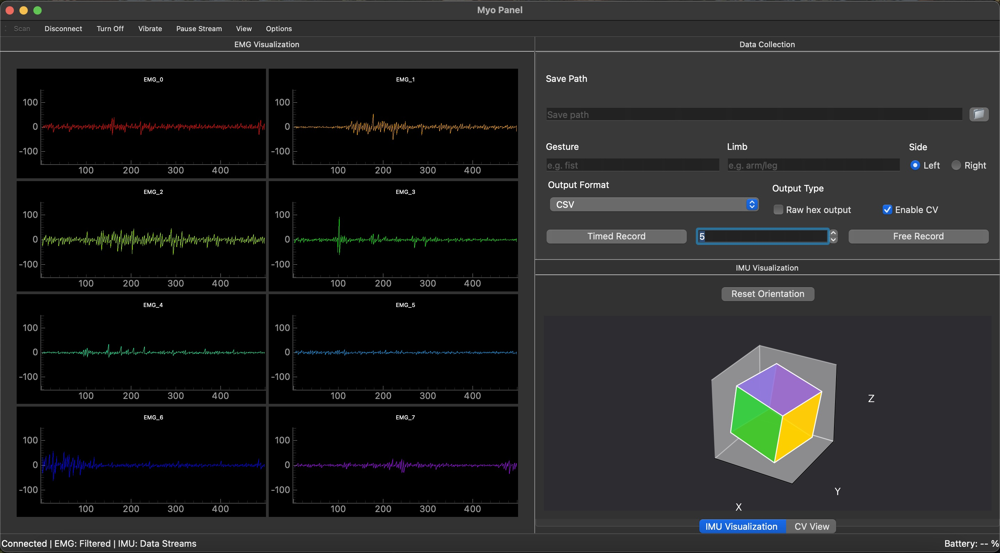
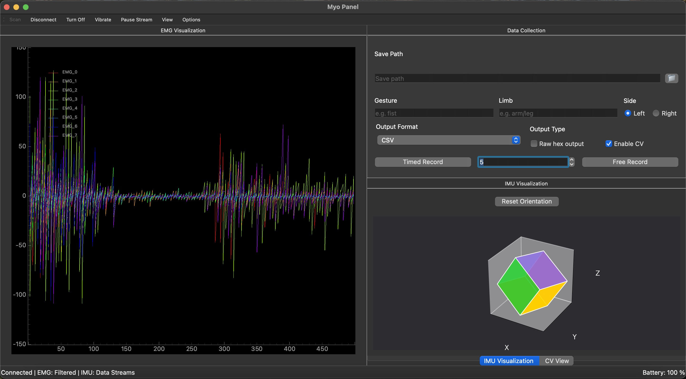
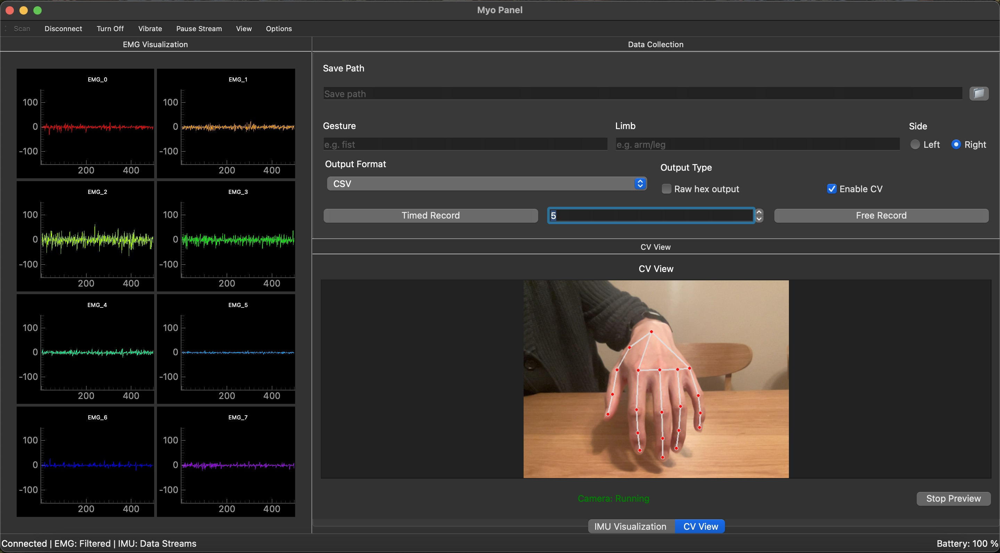

# MYO Panel

A PySide6 application for interfacing with the Thalmic MYO armband. Visualize and record EMG signals, IMU data, and vision-based handlandmarks data.

## Features

- Real-time EMG signal visualization (split channel view and composite views)
- 3D IMU visualization (WIP, currently only showing rotation)
- Vision-based hand landmarks capturing 
- Data recording with customizable settings, including receiving raw hex or processed data
- Configurable EMG and IMU modes (Filtered EMG vs Raw EMG)

### EMG Visualization

*Split view showing 8 EMG channels*


*Composite view of EMG signals*

### Hand tracking

*Mediapipe hand landmark tracking*

## Installation

1. Ensure you have Python 3.8+ installed
2. Download or clone this repository:
   ```bash
   git clone https://github.com/yourusername/myo-panel.git
   cd myo-panel
   ```
3. cd into the directory 
### Development Installation
For development work where you need to modify the code:
```bash
pip install -e .
```

### Production Installation
For regular use or deployment:
```bash
pip install .
```

Or build and install the package:
```bash
# Build the package
python -m build

# Install the built package
pip install dist/myo_panel-*.whl
```

## Usage

### Starting the Application

After installation/build:
```bash
myo-panel
```

### Connecting to MYO

1. Click "Scan" in the toolbar
2. Select your MYO device from the list
3. Click "Connect"
4. Once connected, the status bar will show connection details and battery level

### Data Visualization

- **EMG Data**: Toggle between split view (8 channels) and composite view using the View menu
- **IMU Data**: 3D visualization of device orientation
- **Camera Feed**: Enable CV View in the View menu or Data Collection panel

### Recording Data

1. Use the following buttons from the Data Collection panel to record data:
   - **Timer Recording**: Set duration first and then click "timed record" to start recording data
   - **Free Recording**: Manual start/stop
2. By default, all the data will be saved to the working directory's output folder, or you can configure your own save path, along with all the tags.
3. To enabling CV, you will need to enable camera by going to "View" -> "Show CV view" and allow camera permission.

### Note on How Data is Captured and Processed:

EMG and IMU have different sampling rate
EMG data are sampled at 200 hz and IMU data are at 50 hz
However, EMGs are coming in with 2 samples each packet, so each packet contains 8 sensor data from sample 1 and 8 sensor data from sample 2, which is 16 bytes in total.
IMUs are coming in with 1 sample, including 4 quats, 3 gyro, 3 acc data at 20 bytes in total. 

For raw hex mode, we are just recording the raw packets directly along with your label.

For processed mode, we save the most recently update IMU. Then chop the EMG samples into 2 rows and attach the most recent updated IMU to each row. For vision data, since we are recording at when EMG packet coming in, so they will need to be duplicated for each row. 

Here's an example of how the data is different between raw and processed mode:

**Raw recording**

timestamp 1 - IMU packet 1 - label - vision data 1

timestamp 2 - EMG packet 1 (16 values) - label - vision data 2

timestamp 3 - EMG packet 2 (16 values) - label - vision data 3

**Processed data**

timestamp 2 - EMG packet 1 first 8 values - IMU packet 1 - label - Vision data 2

timestamp 2 - EMG packet 1 second 8 values - IMU packet 1 - label - Vision data 2

timestamp 3 - EMG packet 2 first 8 values - IMU packet 1 - label - Vision data 3

timestamp 3 - EMG packet 2 second 8 values - IMU packet 1 - label - Vision data 3


### Options
For more info on the BLE characteristics, please refer to the Thalmic Labs BLE specifications: https://github.com/thalmiclabs/myo-bluetooth 

#### EMG Modes
- None (0x00)
- Filtered (0x02)
- Raw (0x03)

#### IMU Modes
- None (0x00)
- Data Streams (0x01)
- Motion Events (0x02)
- All Data & Events (0x03)
- Raw Data (0x04)

#### Performance Settings
- Buffer Size: 200-1000 samples
- Refresh Interval: 50-500ms
- Downsample Ratio: 1:1 to 1:16

### Camera Settings
- Multiple camera support
- Adjustable resolution:
  - Low (320x240)
  - Medium (640x480)
  - High (1280x720)

## Controls

- **Scan**: Search for MYO devices
- **Disconnect**: Safely disconnect device
- **Turn Off**: Put device in deep sleep
- **Vibrate**: Test device vibration
- **Pause Stream**: Temporarily pause data visualization

## License

This project is licensed under the MIT License - see the [LICENSE](LICENSE) file for details.

